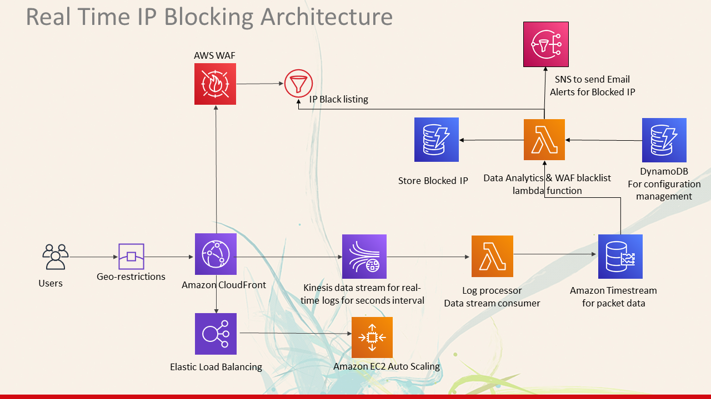
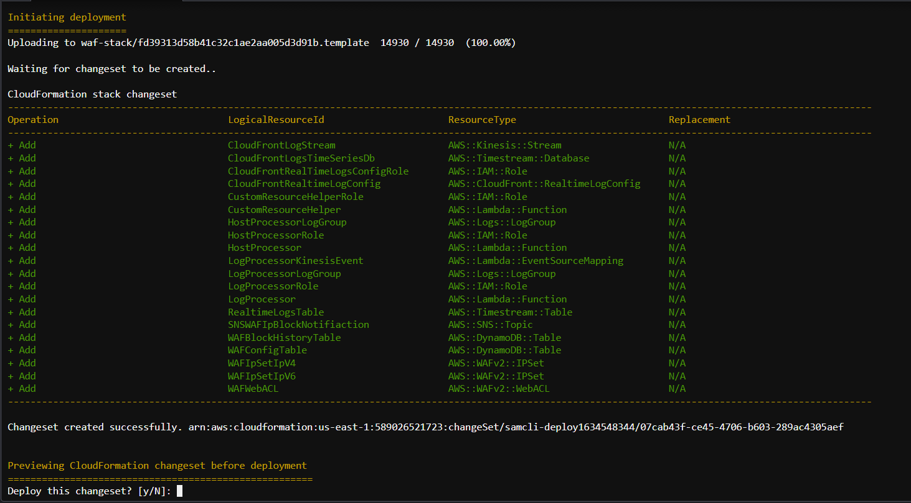
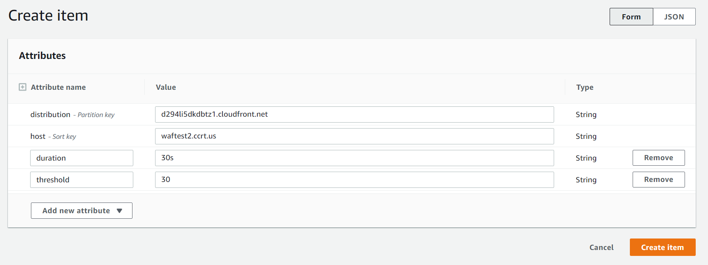
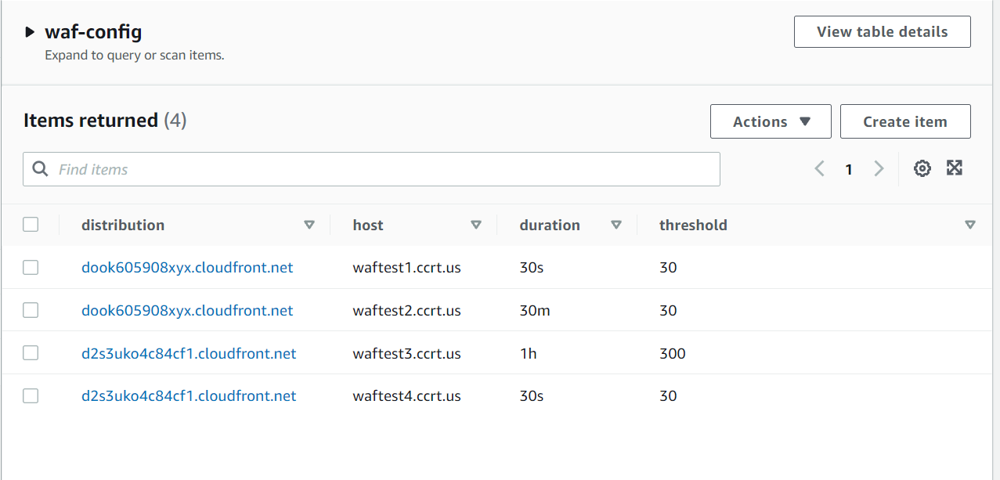
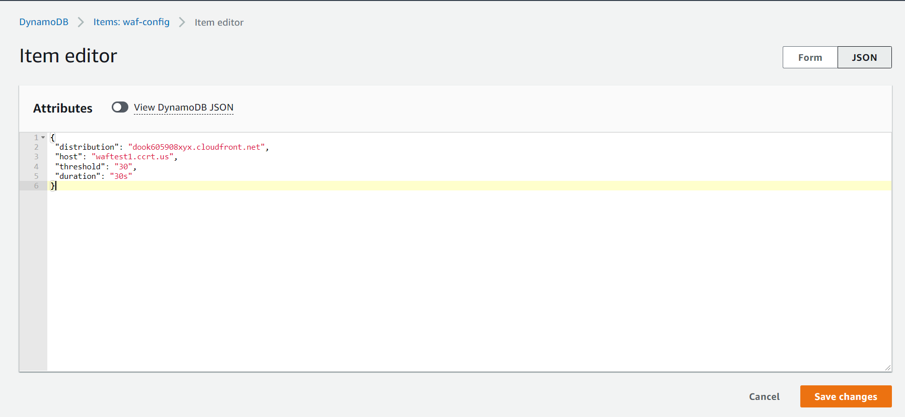
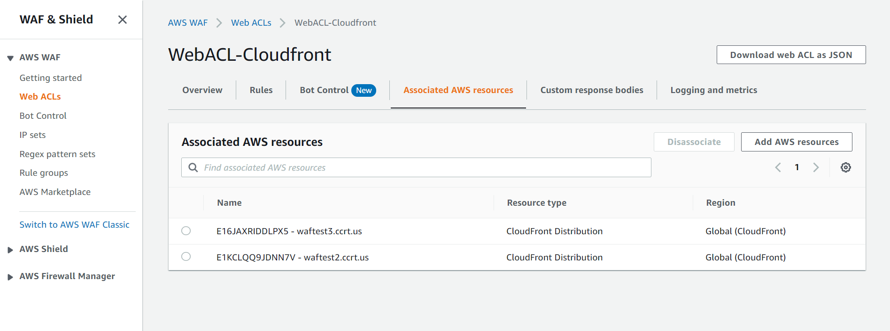
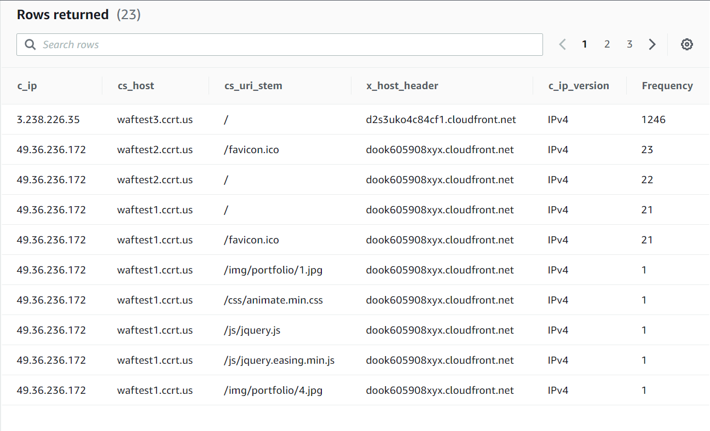

# WAF Automation
[CloudFront real-time logs](https://docs.aws.amazon.com/AmazonCloudFront/latest/DeveloperGuide/real-time-logs.html) and [Web Application Firewall](https://docs.aws.amazon.com/waf/latest/developerguide/waf-chapter.html) enables developers to analyze, monitor, and take action based on content delivery performance. This project provides a serverless solution for processing these logs in real-time to generate custom metrics for real-time logs, analysis, action and alerting. This solution is desined to analyze the Cloudfront Real time logs and taking action based on number of requests made by a user on a particular website in a Cloudfront Distribution.

This project provides a serverless solution to begin processing CloudFront real-time log data in seconds and makes it easy to manage without the need to provision complex infrastructure. The solution creates a CloudFront Real-Time Logs configuration that you can attach to your existing CloudFront Distribution(s). Once attached to your distribution, the log configuration begins sending request log records to a Kinesis Data Stream using a configurable sampling rate. 

The solution deploys AWS 'LogProcessor' Lambda to process the real-time logs from the stream and convert them into time-series records that are ingested into [Amazon Timestream](https://aws.amazon.com/timestream/), a scalable and serverless time-series database. Than 'HostProcessor' Lambda gets invoked. The configuration details like 'host, distribution, threshold, duration' are fetch from Dynamo Db `waf-config` Table. It queries the Timestream Database to find If any Ip is requesting our distribution more than the threshold specified. If Ip is found offending than it is added to Waf IpSet and Dynamo DB `waf-block-ip` Table and a alert email is sent on the specified mail. Entire process is happening Real time. 

#### The Manual configuration is required when:
- To change the configuration details of distribution or host in [waf-config](https://console.aws.amazon.com/dynamodbv2/home?region=us-east-1#item-explorer?initialTagKey=&maximize=true&table=waf-config) Dynamodb table. 
- To configure which cloudfront logs will be sent to Timestream DB. [(Attaching CloudFront to Kineses Real time Logs)](https://console.aws.amazon.com/cloudfront/v3/home?region=us-east-1#/logs)
- WAF Rules should be applied on which Cloudfront. [(Attaching CloudFront to WAF)](https://console.aws.amazon.com/wafv2/homev2/web-acls?region=global)


## Features

* Provides an easy to use integration for monitoring existing CloudFront Distributions
* Built using the AWS Serverless Application Model (AWS SAM) to make it easy to manage the solution using infrastructure as code
* Solution enables operators to monitor metrics with rich high-cardinality metadata by ingestinig the log records as measures and dimensions into time-series database.
* Blocks any Offending IP in Realtime with email alerts.
* Can be easily extended to monitor the metrics using the AWS SDK, Grafana, AWS QuickSight.

## Architecture



## AWS Services

- Amazon CloudFront (does not deploy CloudFront distribution, configures an existing distribution)
- AWS Lambda
- Amazon Kinesis Data Streams
- Amazon Timestream
- Web Application Firewall (It's scope is Global for CloudFront)
- Dynamo DB
- SNS
- AWS Serverless Application Model (AWS SAM)

## Getting Started

This solution is deployed using the AWS Serverless Application Model (AWS SAM). AWS SAM is an open-source framework that makes it easy to build serverless applications on AWS and provides a template specification that is built on top of AWS CloudFormation.

### Installing Pre-requisites

- [Docker cli](https://docs.docker.com/engine/install/rhel/)
- [AWS SAM CLI](https://docs.aws.amazon.com/serverless-application-model/latest/developerguide/serverless-sam-cli-install.html)

### [Installing Docker](https://docs.docker.com/engine/install/rhel/)
Note that Docker is also required to use AWS SAM CLI and is included in the above steps. After installation, make sure Docker is running on your local machine before proceeding.

```bash
curl -fsSL https://get.docker.com -o get-docker.sh
sudo sh get-docker.sh
docker version
sudo systemctl start docker
sudo systemctl enable docker
```

### [Install Sam Cli](https://docs.aws.amazon.com/serverless-application-model/latest/developerguide/serverless-sam-cli-install-linux.html#serverless-sam-cli-install-linux-sam-cli)

Sam cli Installation for Linux x86_64 architecture

```bash
curl -L https://github.com/aws/aws-sam-cli/releases/latest/download/aws-sam-cli-linux-x86_64.zip -o ./aws-sam-cli-linux-x86_64.zip
unzip aws-sam-cli-linux-x86_64.zip -d sam-installation
sudo ./sam-installation/install
sam --version
```

### Clone the repository
```
git clone https://github.com/shunyeka-spl/waf-automation-aws.git
```


### [Build](https://docs.aws.amazon.com/serverless-application-model/latest/developerguide/sam-cli-command-reference-sam-build.html)
The AWS SAM CLI provides the necessary components to build the dependencies for the Python Lambda Functions defined in this solution using the *sam build* command. It also copies the source code into local staging folders under *.aws-sam/build* before it zips and uploads the function source to Amazon S3.

Navigate to the cloned folder:

```bash
cd waf-automation-aws
```

Build the serverless application using AWS SAM:

```bash
sam build --use-container
```

> **Note:** Using the ```--use-container``` flag informs the SAM CLI to build your Lambda Function inside of a local Docker container using the language runtime that is defined for the Lambda function(s) in the template. This helps prevent issues that may occur from building the functions using a local version of Python on your local machine that is different than the runtime Lambda uses to execute your function in AWS. This process may take a few minutes to execute because the appropriate Docker Image(s) need to be pulled to your local machine to execute the build.

### [Deploy](https://docs.aws.amazon.com/serverless-application-model/latest/developerguide/sam-cli-command-reference-sam-deploy.html)
When you initially deploy the SAM template, be sure to use the ```--guided``` flag as shown below which generates a local configuration file *samconfig.toml* for your SAM project.  This file is ignored by the included *.gitignore*. Future deployments can use the simplified `sam deploy` command which will use the generated configuration file *samconfig.toml*.

```bash
sam deploy --guided
```

#### Provide all the input values
```
Configuring SAM deploy
======================

        Looking for config file [samconfig.toml] :  Found
        Reading default arguments  :  Success

        Setting default arguments for 'sam deploy'
        =========================================
        Stack Name [waf-automation-2]: waf-stack              # Cloud Formation Stack Name
        AWS Region [us-east-1]:                               # Press enter to choose the default value. This Template will only work in Region us-east-1
        Parameter KinesisStreamShards [2]: 1                  # Number of Kineses Shards that will Transfer Logs to Timestream ( 1 Shard can Transfer 1K Messages in 1 sec approx)
        Parameter RealtimeLogsSamplingPercentage [2]: 5       # A Single GET request can make 100 or more logs. So, we generally set SamplingRate between 1-5 % based on the number of request.
        Parameter EmailAddress [email@gmail.com]: email@gmail.com        # Email Address to send IP Blocked Alerts
        Confirm changes before deploy [Y/n]: Y                # Shows you resources changes to be deployed and require a 'Y' to initiate deploy
        Allow SAM CLI IAM role creation [Y/n]: Y              # SAM needs permission to be able to create roles to connect to the resources in your template
        Save arguments to configuration file [Y/n]: Y         # Saves the above arguments in the configuration file
        SAM configuration file [samconfig.toml]:              # Press Enter to choose the default. sam cli always looks for samconfig.toml file when we do sam deploy, custom conf file can be passed by using --config-file flag
        SAM configuration environment [default]:              # Press Enter to choose the default. Which profile to use to deploy the sam template
        Looking for resources needed for deployment: Found!

                Managed S3 bucket: aws-sam-cli-managed-default-samclisourcebucket-1c344o97df3f8
                A different default S3 bucket can be set in samconfig.toml

        Saved arguments to config file
        Running 'sam deploy' for future deployments will use the parameters saved above.
        The above parameters can be changed by modifying samconfig.toml
        Learn more about samconfig.toml syntax at 
        https://docs.aws.amazon.com/serverless-application-model/latest/developerguide/serverless-sam-cli-config.html
```
#### Approve the ChangeSet




Follow the guided steps to deploy the stack, including creating an S3 Bucket for the build artifacts to be stored in the cloud. Instructions for this process can be found [here](https://docs.aws.amazon.com/serverless-application-model/latest/developerguide/serverless-deploying.html).

**CloudFormation Stack Parameters**:

- **KinesisStreamShards**: Integer value representing the number of shards to provision for the deployed Kinesis Data Stream. Defaults to `1`. Instructions are provided in the [CloudFront documentation](https://docs.aws.amazon.com/AmazonCloudFront/latest/DeveloperGuide/real-time-logs.html#understand-real-time-log-config-endpoint) for estimating the number of shards needed for a deployment.

- **RealtimeLogsSamplingPercentage**: Integer value between 1-100 that represents the percentage of viewer requests to CloudFront to sample for generating realtime log records. Defaults to `5` (5%). This value is used when CloudFormation creates the Realtime Log Configuration.

- **EmailAddress**: The Email Address where Blocked IP Notification will be sent.

#### General samlconfig.toml file

```samlconfig.toml
version = 0.1
[default]
[default.deploy]
[default.deploy.parameters]
stack_name = "waf-stack"
s3_bucket = "aws-sam-cli-managed-default-samclisourcebucket-1c344o97df3f8"
s3_prefix = "waf-stack"
region = "us-east-1"
capabilities = "CAPABILITY_IAM"
parameter_overrides = "KinesisStreamShards=\"1\" RealtimeLogsSamplingPercentage=\"5\" EmailAddress=\"email@host.com\""
confirm_changeset = true
```

#### Deploy a New Version

When Updating application. A Single command to validate, build and deploy sam template. The already made configuration file `samconfig.toml` will be used by default.
```bash
sam validate && sam build --use-container && sam deploy --no-confirm-changeset
```
> --no-confirm-changeset = skips the promt for approval to deploy changeset

### Add values to Dynamo DB Table

<details><summary><b>Expand this to view how to add values to Dynamo DB Table 'waf-config'</b></summary><br>

<b>Go to waf-config table</b> - [Click here](https://console.aws.amazon.com/dynamodbv2/home?region=us-east-1#table?initialTagKey=&name=waf-config)

1. Click on View Items

2. Then Click on Create Item

3. Add `distribution`, `host`, `duration`, `threshold` Column values.



4. Finally it should look like this



> __distribution__: Contains the Cloud Front Distribution name

> __host__: The domain name of the website

> __duration__: For how much time to check for request. The duration to check for request count. Maximum duration can be 2hr after that timestream logs automatically gets deleted (Timestream Logs Retention Period can be increased from console). 
> eg: `15s`, `15m`, `1hr`

> __threshold__: integer, The Number of requests that are allowed in a specific duration, If requests reaches more than threshold block that IP.

5. An Example in json. You can also directly upload a json object to Dynamo DB.



```json
{
 "distribution": "dook605908xyx.cloudfront.net",
 "host": "waftest1.ccrt.us",
 "threshold": "30",
 "duration": "30s"
}
```

</details>

Navigate to the AWS CloudFormation console and review the stack resources that were created for you. 

## Attach the log configuration to your CloudFront Distribution(s)

When the solution is deployed, it creates a new CloudFront Realtime Logs Configuration but it does not automatically associate this log configuration with your CloudFront Distribution(s). You can attach this configuration to your CloudFront Distribution by navigating to the CloudFront Realtime Logs [console](https://console.aws.amazon.com/cloudfront/v2/home#/logs/realtime), and associating the configuration with your distribution using the **Attach to distribution** option. Once the real-time configuration is attached to your distribution with a status of **Deployed**, then you can then begin analyzing your metrics in Timestream.

## Attach the CloudFront Distribution(s) to WAF Web Acl

When the solution is deployed and WAF Web Acl is successfully created, We need to attach Cloud Front Distribution with WAF WebAcl. 

1. Navigate to WAF WebAcl, Go in WebACL-Cloudfront
2. Click on 'Associated AWS Resources'
3. Then Click on 'Add AWS Resources' and Select the Cloudfront you want to add.
4. Finally it should look like this.



## Query your metrics with Amazon Timestream

Once the solution is deployed and you have attached your distribution to the Real-time log configuration, you should be able to start querying your metrics in Amazon Timestream. Navigate to [Amazon Timestream](https://console.aws.amazon.com/timestream/home) query editor, or use the query editor link provided in the CloudFormation Outputs.

**Example Query**: Hourly sum of downloaded bytes by edge location over 24 hours

You can copy the below query into the query editor and select **Run**. Be sure to replace the database and table values with your own in the `FROM` clause.

```
-- Get the number of requests on all the Cloudfront distribution over the last 15 minutes

SELECT c_ip, cs_host, cs_uri_stem, x_host_header, c_ip_version, COUNT(c_ip) AS Frequency 
FROM "<TIMESTREAM DATABASE NAME>"."<TIMESTREAM TABLE NAME>"
WHERE time between ago(15m) and now() AND c_ip != '-' 
GROUP BY c_ip,cs_host,cs_uri_stem,c_ip_version,x_host_header 
ORDER BY Frequency 
DESC
```

The query should return results similar to below:



## Performance Optimization

This solution is build using AWS Mangaed serverless services. So, most of the management part is automatically done by AWS. We have to define the Maximum, Mininum, Concurrency of Services.

- When the requests on Cloudfront are high you can increase the Number of Shards in Kineses(one shard in kineses can transfer 1MiB/sec ~ 1000 logs/sec).
- When the load is high, you can increase the read capacity of DynamoDB Tables (waf-config and waf-ip-block-history). As more `get_item()` requests will be made to dynamodb from Lambda Functions. Default Read is 5 and Write is 1 for both tables.
- Lambda Functions are serverless they are managed by AWS. Default Concurrency is 1000.
- TimeStream DB is highly scalable managed database giving milisecond latency for queries where time duration is less than 7 hrs(NOTE: 7hrs is InMemory retention period set for data,). For queries where duration is more than 7 hrs it can take some seconds to give output. You can query the logs for maximum duration of 1 Day.

> **Note:** All the above values can be increased or decreased based on requirement.

## Logs Retention Period

**Retention Period:** The amount of time Logs will be stored in the CloudWatch, After that time Logs will be automatically Deleted permanently.

Retention Period of different AWS Services used in this solution.

* LogProcessor Logs: 30 Days
* HostProcessor Logs: 30 Days
* CloudFront Realtime Logs: Enabled
* Kineses Shards Data: 1 Day(s)
* Timestream Table Data: 
  * InMemory Storage: 7 Hours
  * Disk Storage: 1 Day(s)
* WAF Logs:
  * Sampling Requests: 3 Hours (Managed by AWS, Free of charge)
  * Event Metrics: Enabled (Can be seen in CloudWatch Metrics for every Rule)
  * Logs: Disabled  (Need to configure AWS Kineses Firehose and S3 bucket)

> **Note:** The Logs Retention Period can be increased or decreased based on requirement.

## Customize the solution (optional)

### Modify the CloudFront Realtime Log fields

This section includes instructions for modifying the fields that are included in Realtime logs and processed by the solution.

CloudFront delivers real-time logs to Amazon Kinesis with fields presented in a specific pre-defined order as defined in the CloudFront documentation. Therefore, the solution's log processor Lambda function must be configured properly beforehand in order to process the specified fields in the order they are delivered by CloudFront. By default, this solution is configured to ingest all of CloudFront's available real-time fields. To further reduce costs and minimize the amount of log data stored by the solution, you can modify the fields that are included in CloudFront Realtime logs by following the below steps:

<details><summary>Expand this section to modify the solution to add or remove log fields from the solution configuration - Click to expand (optional)</summary>

**Step 1. Modify the SAM template** 

The CloudFront Realtime Logs Configuration is managed as a resource defined in the solution's AWS SAM template using the [AWS::CloudFront::RealtimeLogConfig](https://docs.aws.amazon.com/AWSCloudFormation/latest/UserGuide/aws-resource-cloudfront-realtimelogconfig.html) resource type. In order to modify the log configuration used in the solution, perform the following steps:

- Open the solution CloudFormation template located at ```./template.yaml```.
- In the template, modify the **Fields** defined in the CloudFront Realtime Logs Configuration **CloudFrontRealtimeLogConfig** as needed.

**Step 2: Modify the log processor Lambda function**

CloudFront does not include field headers/names in the logs that are delivered to Kinesis. Therefore the Lambda log processor function must be pre-configured to properly parse the order of the fields and their data types. The solution includes a JSON configuration file that is packaged alongside the Lambda function source code that defines each of the available Realtime log fields and a data mapping for the field. This data mapping is used by Lambda to process the field in the absence of field headers/names. Perform the following steps to update the function configuration:

- Open the field mapping configuration file located at ```./log-processor/config/cf_realtime_log_field_mappings.json```. This file contains a mapping of all available CloudFront realtime log fields and the data type that should be used to process the field. 
- Confirm that any fields you added to the CloudFront Realtime Configuration in Step 1 are defined in this JSON config with a data type, otherwise the Lambda function will not be able to process the field. It is possible that CloudFront may add additional log fields in the future. If so, before you will be able to use those new fields you will need to define those fields and data types in this configuration file.

**Step 3: Modify the host processor Lambda function**

This Function is responsible for 

- Querying the Timestream Database for check if any ip request count is greater threshold.
- Multithreading is used in Function to increase the efficiency as it is querying the DB for IPv4 and Ipv6 IP's in parallel.
- Updating the Waf IpSet with the offending Ip with retry mechanism.
- Adding the IP entry in Dynamo DB table 'waf-block-history'.
- Sending one mail per ip blocked.

Use this opportunity to make any other processing changes to the code as you like.

**Step 4: Build/Deploy the SAM template**

Once you have made these changes you can execute ```sam build --use-container && sam deploy``` to deploy your modified version of the solution to AWS. These two commands will build, package and deploy the solution's Lambda functions and other AWS resources as a CloudFormation stack.

**Step 5: Modify the fields in the CloudFront real-time logs configuration**

Once you have deployed the modified solution, you can attach your Realtime Log Configuration to one or more of your CloudFront Distributions in order to generate real-time metrics.

**Step 6: Attach the CloudFront to WAF Web Acl**

Once you have deployed the modified solution, you can attach your CloudFront Distributions to WAF WebACL. In Console Select Region as Cloudfront (Global). So, If an IP is blocked, It will show 403 unauthorized message.

</details>

After you have setup the real-time logs configuration for your CloudFront distribution, follow the steps in the below section to monitor your custom metrics.

## Troubleshooting

If you encounter any issues or are not receiving data in Timestream, you can use CloudWatch Logs to investigate any processing issues with the solution's Lambda Function. The **LogProcessor** and **HostProcessor**Lambda Function generates logs that are stored in Amazon CloudWatch. The log group can be found in the Outputs tab of the CloudFormation Stack.

## Frequently Asked Questions (FAQ)

### 1) Should I use CloudFront Real-time or Standard Logs?
CloudFront provides two forms of logging, including real-time logs which are delivered to Amazon Kinesis within seconds of a request, and [standard logs (access logs)](https://docs.aws.amazon.com/AmazonCloudFront/latest/DeveloperGuide/AccessLogs.html) which are delivered in batch periodically to an Amazon S3 bucket. Depending on your requirements you may want to use one or both of these logging solutions. This project provides an easy way for developers to generate their own customized metrics from their CloudFront logs when insights are needed within seconds as opposed to hours or days. This solution may also be useful if you require metrics at a more granular level than the default Distribution-wide metrics from CloudFront. For example, this solution can be used to analyze performance based on the end user's location or the specific edge location that served the request. This solution makes a trade off of precision/accuracy in favor of performance, and uses log sampling to reduce costs. If you do not need real-time visibility into performance of CloudFront Distributions and require a reporting or ad-hoc analytics solution, then it is recommended to use CloudFront Standard Logs. You can also adjust the sampling rate depending as required.

### 2) How can I update the solution?
Due to the fact that CloudFront Realtime Log fields are strictly ordered but do not include self-defining header names, this solution treats a Realtime Log Configuration, Kinesis Stream, and Lambda Function as a tightly coupled single unit of deployment for the purposes of infrastructure management. If you intend to make any additions/removals to the CloudFront Realtime Log fields in a previously deployed stack, it is recommended to deploy those changes as a new separate CloudFormation stack, which will result in a new Timestream database and table that is used for that stack's time-series metrics. This recommendation will help avoid undesirable behaviors such as multiple log records in a Kinesis batch that have different fields which may result in processing errors in the function. Once the new stack is deployed you can attach it your CloudFront Distribution and detach the old real-time configuration, then delete the old stack. Due to the fact that each stack publishes metrics to its own Timestream database table, metrics should remain accurate during a migration and this process should enable you to perform a "blue/green" deployment strategy for changes to your real-time monitoring solution.

### 3) What is the estimated cost of using this solution?
The cost of running this solution will depend on the amount of log records that are ingested from CloudFront, the number of fields included in those records, and whether or not you make any customizations to the data that is loaded into Amazon Timestream, how frequently you query the data in Timestream, The amount of time waf ipset is updated, the amount of Get, Put queries made to Dynamo DB. Also the number of mails send SNS. 

**Solution default settings:**

* Lambda max batch size: `1000`
* Kinesis Data Stream Shards: `1`
* Timestream writes per batch: `100`
* CloudFront Real-time Log Fields: `All`
* CloudFront Real-time Log Sampling Rate: `5%`

### Uninstall

* Delete the Cloud Formation Stack
* Delete the Sam S3 bucket (Bucket name is prefixed with CloudFormation stack name)
* Delete the git repository

* Uninstall the sam cli
```bash
sudo rm $(which sam)
sudo rm -rf /usr/local/aws-sam-cli
```

* Uninstall docker
```bash
sudo docker system prune --all -f
sudo yum remove docker-ce docker-ce-cli containerd.io
sudo rm -rf /var/lib/docker
sudo rm -rf /var/lib/containerd
```

AWS Reference Documentation
- [SAM Cli](https://docs.aws.amazon.com/serverless-application-model/latest/developerguide/serverless-getting-started.html)
- [Timestream](https://docs.aws.amazon.com/timestream/latest/developerguide/what-is-timestream.html)
- [Kinesis](https://docs.aws.amazon.com/streams/latest/dev/introduction.html)
- [CloudFront](https://docs.aws.amazon.com/AmazonCloudFront/latest/DeveloperGuide/Introduction.html)
- [Lambda](https://docs.aws.amazon.com/lambda/latest/dg/welcome.html)
- [Dynamo DB](https://docs.aws.amazon.com/amazondynamodb/latest/developerguide/Introduction.html)
- [SNS](https://docs.aws.amazon.com/sns/latest/dg/welcome.html)
